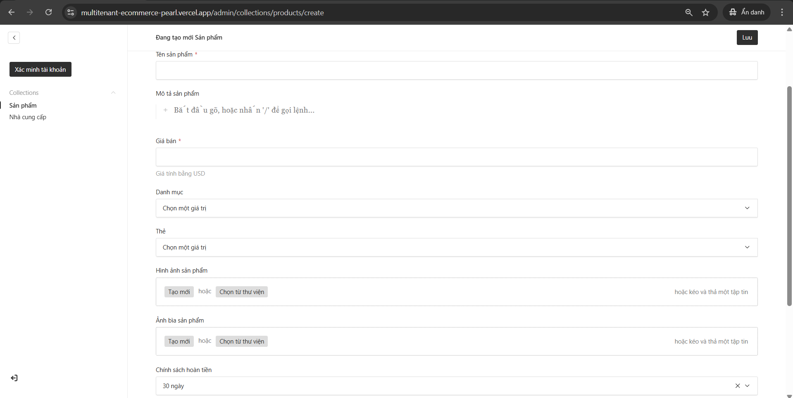

<h1 align="center">🛒 Multi-Tenant Marketplace Platform</h1>

<p align="center">
A modern <b>full-stack multi-vendor marketplace</b> built with <b>Next.js 14</b>, <b>Payload CMS</b>, and <b>Stripe Connect</b>.
</p>

<p align="center">


</p>

---

## 🚀 Live Demo

🌐 **[E-commerce Multi Vendor Website](https://multitenant-ecommerce-pearl.vercel.app/)**

---

## ⭐ Project Highlights

This project demonstrates how to build a **production-ready multi-vendor marketplace** using modern web technologies.

Key architectural concepts implemented:

- **Multi-Tenant Marketplace Architecture**
- **Stripe Connect Revenue Splitting**
- **Headless CMS architecture**
- **Type-Safe APIs using tRPC**
- **Server-Side Rendering with Next.js**
- **Role-Based Access Control**

The architecture is inspired by real-world platforms such as:

- Amazon  
- Shopee

---

## 🧠 System Overview

Unlike traditional e-commerce websites, this system allows **multiple independent vendors** to operate within the same platform.

Each vendor can:

- Manage their own products
- Track their own orders
- Receive payments automatically

Meanwhile, the **platform administrator maintains full control of the marketplace ecosystem**.

---

# 🏗 System Architecture

The platform follows a modern full-stack architecture optimized for scalability.

```text
Client (Browser)
        |
        v
Next.js Frontend
        |
        v
tRPC API
        |
        v
Payload CMS
        |
        v
MongoDB
```

---

## 💳 Payment Flow (Stripe Connect)

The platform uses **Stripe Connect** to securely process transactions between customers, the marketplace platform, and independent vendors.

This architecture enables **automatic revenue splitting** and ensures vendors receive payouts directly to their own Stripe accounts.

---

### 1️⃣ Vendor Onboarding & Verification

Before a vendor can list products on the marketplace, they must complete **Stripe Identity Verification (KYC)** through the vendor dashboard.

During this process:

- Vendor is redirected to **Stripe Onboarding**
- Stripe collects identity and banking information
- A **Stripe Connected Account** is created for the vendor

This ensures compliance with financial regulations and enables vendors to receive payouts securely.

---

### 2️⃣ Transaction Lifecycle

When a customer purchases a product, the payment process follows this lifecycle:

```text
Customer Checkout
        |
        v
Stripe Payment Intent Created
        |
        v
Payment Confirmed
        |
        v
Application Fee Deducted
        |
        v
Vendor Earnings Transferred
        |
        v
Stripe Payout to Vendor Bank Account
```

---

### 3️⃣ Automated Revenue Splitting

Stripe Connect automatically splits the payment **at the time of purchase**.

Each transaction is processed as follows:

**Application Fee (Platform Revenue)**  
The marketplace deducts a configurable **application fee** (for example 10%) from the order value.

**Vendor Earnings**  
The remaining balance is instantly routed to the vendor’s **isolated Stripe Connected Account**.

This architecture allows the platform to scale to **multiple independent vendors** without handling sensitive banking logic directly.

---

## 🧰 Tech Stack

### Frontend

- Next.js 14 (App Router)
- React Server Components
- TailwindCSS
- Shadcn UI

### Backend

- Payload CMS
- tRPC API

### Database

- MongoDB

### Payment

- Stripe
- Stripe Connect

### Package Manager

- Bun

### Deployment

- Vercel

---

## 🔥 Features

### 🛍 Customer

Customers can:

- Browse products from multiple vendors
- Search and filter products
- Manage shopping cart
- Checkout securely using Stripe
- View order history

---

### 🏪 Vendor

Each vendor operates independently within the platform.

Features include:

- Vendor dashboard
- Product management
- Order tracking
- Revenue monitoring
- Stripe payout integration

---

### 👑 Admin

Platform administrators can:

- Manage users
- Approve vendors
- Monitor products
- Maintain marketplace integrity

---

## 📸 Screenshots

<!--
Add screenshots here when available.

Example:



-->

---

# ⚙️ Installation

### 1️⃣ Prerequisites

Make sure you have the following installed:

- Node.js (v18+)
- Bun
- MongoDB Database (MongoDB Atlas recommended)
- Stripe Developer Account

---

### 2️⃣ Clone repository

```bash
git clone https://github.com/thaison0401/multitenant-ecommerce.git
cd multitenant-ecommerce
```

---

### 3️⃣ Install dependencies

Recommended:

```bash
bun install
```

Alternative:

```bash
npm install
```

---

### 4️⃣ Configure environment variables

Create a `.env.local` file in the root directory.

Example configuration:

```env
# Database
MONGODB_URI=your_mongodb_connection_string

# Payload CMS
PAYLOAD_SECRET=your_payload_secret_key

# App URL
NEXT_PUBLIC_SERVER_URL=http://localhost:3000

# Stripe
STRIPE_SECRET_KEY=sk_test_...
STRIPE_WEBHOOK_SECRET=whsec_...

# Vercel Blob Storage
BLOB_READ_WRITE_TOKEN=vercel_blob_token
```

---

### 5️⃣ Initialize Database

Generate Payload types:

```bash
bun run generate:types
```

Reset database (optional if old data exists):

```bash
bun run database:fresh
```

Seed database with initial data:

```bash
bun run database:seed
```

⚠️ Note: Do **not run `fresh` and `seed` simultaneously** to avoid MongoDB write conflicts.

---

### 6️⃣ Run development server

```bash
bun run dev
```

or

```bash
npm run dev
```

Open browser:

```
http://localhost:3000
```

---

## 🔑 Default Admin Access

Admin dashboard:

```
http://localhost:3000/admin
```

Credentials:

```
Email: admin@demo.com
Password: demo
```

---

# 📂 Project Structure

```text
multitenant-ecommerce/
|
├── app/            # Next.js App Router pages
├── components/     # Reusable React components
├── collections/    # Payload CMS collections (schemas)
├── lib/            # Utility functions and helpers
├── public/         # Static assets
├── styles/         # Global CSS styles
└── trpc/           # Type-safe API routers
```

---

## 🔐 Security Features

- Secure Stripe payment integration
- Authentication and authorization
- Role-based access control
- Server-side validation

---

## 📈 Future Improvements

Potential upgrades:

- Product reviews and ratings
- Vendor analytics dashboard
- Real-time notifications
- Chat between buyers and vendors
- AI product recommendation
- Microservices architecture

---

## 👨‍💻 Author

**Tran Thai Son**

Information Technology Student

Interested in **Full-Stack Development, System Architecture, and Scalable Web Applications**

GitHub  
https://github.com/thaison0401

---

## ⭐ Support

If you like this project, consider giving it a **star ⭐ on GitHub**.
